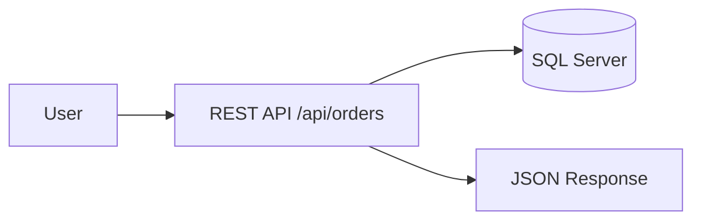
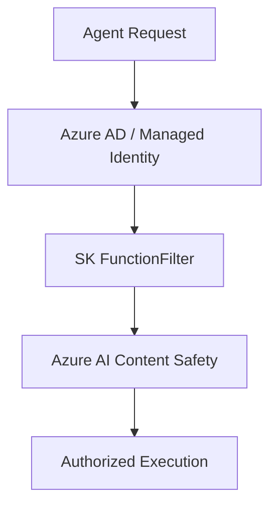

```yaml
---
title: "Your .NET App Will Be an AI Agent (Whether You Like It or Not) | by Mohammad Shoeb | Aug, 2025 | Dev Genius"
source: https://blog.devgenius.io/your-net-app-will-be-an-ai-agent-whether-you-like-it-or-not-a9fb120fb52b
date_published: 2025-08-27T14:31:44.188Z
date_captured: 2025-09-04T11:43:15.585Z
domain: blog.devgenius.io
author: Mohammad Shoeb
category: ai_ml
technologies: [.NET, Semantic Kernel, Model Context Protocol, Azure Functions, Event Grid, Service Bus, Azure AI Studio, Microsoft Copilot, SQL Server, Durable Functions, Azure AI Search, Azure Active Directory, Managed Identity, Azure AI Content Safety, JwtBearerDefaults, MicrosoftIdentityWebApi, OpenTelemetry, Azure AI Foundry, REST]
programming_languages: [C#, SQL]
tags: [.net, ai-agents, semantic-kernel, azure, copilot, api-design, orchestration, enterprise-architecture, zero-trust, cloud-native]
key_concepts: [AI agents, agentic plugins, Model Context Protocol, Semantic Kernel, workflow orchestration, Zero Trust security, prompt caching, multi-agent systems]
code_examples: false
difficulty_level: intermediate
summary: |
  This article asserts that all .NET applications are evolving into AI agents, a shift driven by Microsoft's strategic focus on agentic capabilities. It introduces Microsoft's core agentic stack: Semantic Kernel for creating AI-callable plugins, Model Context Protocol for agent discovery and invocation, and Azure Orchestration services for scalable and resilient workflows. The author contrasts traditional REST APIs with this new paradigm, highlighting the autonomous nature of agents. The piece also addresses critical enterprise concerns such as Zero Trust security, cost management through elasticity and prompt caching, and provides an actionable plan for .NET developers to adapt to this agent-driven future.
---
```

# Your .NET App Will Be an AI Agent (Whether You Like It or Not) | by Mohammad Shoeb | Aug, 2025 | Dev Genius

# Your .NET App Will Be an AI Agent (Whether You Like It or Not)

## Why This Blog Matters

At **Microsoft Build 2024**, Satya Nadella put it plainly:

> “Every app will embrace AI agent capabilities”_🎥_ [_Build 2024 Keynote_](https://www.youtube.com/watch?v=8OviTSFqucI&ab_channel=Microsoft)

This isn’t marketing fluff. Microsoft is restructuring the .NET ecosystem around:

*   [**Semantic Kernel (SK)**](https://learn.microsoft.com/en-us/semantic-kernel/overview/) → wrap your .NET logic as agentic plugins.
*   [**Model Context Protocol (MCP)**](https://learn.microsoft.com/en-us/microsoft-copilot-studio/agent-extend-action-mcp) → standard for discovery + invocation.
*   [**Azure Orchestration**](https://learn.microsoft.com/en-us/azure/azure-functions/durable/durable-functions-orchestrations?tabs=csharp-inproc) → Functions, Event Grid, Service Bus, AI Studio for scale + governance.

Whether you like it or not, your .NET APIs will be called by **agents reasoning about goals — not just humans clicking buttons.**

Not a medium member? you can read this blog [here](https://medium.com/@mohsho10/your-net-app-will-be-an-ai-agent-whether-you-like-it-or-not-a9fb120fb52b?sk=004fffb7b7191dbe30718a64ed5d68e4).


## From APIs to Agents: The Evolution

👉 **APIs wait. Agents act.**

## Enterprise in Practice: Order Management with Agents

Imagine an order management system at Contoso Electronics. In the old REST world, users called endpoints directly. In the new agentic paradigm, a finance agent chains together calls autonomously, handles retries, and notifies the user only when all is done — while Azure governance keeps a watchful eye.

## Microsoft’s Agentic Stack

## 1\. Semantic Kernel (SK) — AI Runtime for .NET

SK lets you expose .NET functions as AI-callable plugins. Planners then chain them together dynamically.

📖 [Semantic Kernel Documentation](https://learn.microsoft.com/en-us/semantic-kernel/)

```csharp
// Order Plugin (production-flavored)  
public class OrderPlugin  
{  
    private readonly OrderService _service;  
    private readonly FinanceService _finance;  
    private readonly ILogger<OrderPlugin> _logger;  
  
    public OrderPlugin(OrderService service, FinanceService finance, ILogger<OrderPlugin> logger)  
    {  
        _service = service;  
        _finance = finance;  
        _logger = logger;  
    }  
  
    [KernelFunction("CreateOrder")]  
    public string CreateOrder(string product, int quantity, SKContext context)  
    {  
        _logger.LogInformation("Creating order for {Product}, Qty {Qty}", product, quantity);  
        var orderId = _service.Create(product, quantity);  
        context.Variables["orderId"] = orderId; // memory injection  
        return orderId;  
    }  
  
    [KernelFunction("NotifyFinance")]  
    public void NotifyFinance(SKContext context)  
    {  
        var orderId = context.Variables["orderId"];  
        _logger.LogInformation("Notifying Finance for Order {OrderId}", orderId);  
        _finance.Notify(orderId);  
    }  
}
```

**Planners** use these plugins dynamically:

```csharp
// Planner usage  
var result = await kernel.InvokePromptAsync(  
    "Order 200 units of WidgetA and notify Finance"  
);
```

💡 Note how `SKContext` + logging makes this **production-grade**, not demo-ware.

I have written deep dive blog earlier on creating [AI Agentic using Semantic kernal](https://towardsdev.com/semantic-kernel-microsofts-gateway-to-agentic-ai-and-the-one-sdk-you-should-master-in-2025-ef3004e918e4) and creating [creating multi agent system.](https://medium.com/@mohsho10/part-2-how-to-build-a-full-multi-agent-ai-system-in-net-a1804c6e12f1)

## 2\. Model Context Protocol (MCP) — Standard Wiring

MCP is **gRPC for agents**.

*   Your .NET service registers its plugins.
*   Copilot in VS Code, Teams, Dynamics auto-discovers them.
*   No custom glue — Copilot calls your tools natively.

📖 [Model Context Protocol](https://techcommunity.microsoft.com/blog/educatordeveloperblog/unleashing-the-power-of-model-context-protocol-mcp-a-game-changer-in-ai-integrat/4397564)

I have written a detailed blog on [MCP](https://medium.com/dev-genius/mcp-c-sdk-the-future-nobody-notices-yet-507d9d931370) earlier.

## 3\. Azure Orchestration — From Demo to Production

Microsoft anchors agent workflows in resilient cloud primitives:

*   **Durable Functions** → checkpointed, retry-safe orchestration.
*   **Event Grid + Service Bus** → absorb surges, meter retries.
*   **Azure AI Search (RBAC-aware)** → semantic memory, governed by enterprise roles.

📖 [Durable Functions Overview](https://learn.microsoft.com/en-us/azure/azure-functions/durable/durable-functions-overview?tabs=in-process%2Cnodejs-v3%2Cv1-model)

When your agent floods Finance at **3 AM** with retries, these primitives are your brakes.

Please refer my earlier blog on [Workflow Orchestration](https://medium.com/towardsdev/youre-not-just-a-net-developer-anymore-why-microsoft-wants-you-thinking-in-workflows-8f5f4d0796e2) and how to do it.

## Before vs After

## Old World (REST)



## New World (Agentic .NET)

```mermaid
flowchart LR  
    U[User: "Order 200 units & notify Finance"]  
    --> C[Copilot Host]  
    --> M[MCP]  
    --> SK[Semantic Kernel Planner]  
    --> P[OrderPlugin: CreateOrder + NotifyFinance]  
    --> F[Finance System]
```

In the new world, **you don’t script the glue. The agent reasons it.**

## 🔒 Security: Zero Trust for Agents

Treat agents like hostile clients. Microsoft’s model is **layered enforcement**:



*   **Authentication:** Secure MCP endpoints with Azure AD.

```csharp
builder.Services.AddAuthentication(JwtBearerDefaults.AuthenticationScheme)  
    .AddMicrosoftIdentityWebApi(builder.Configuration.GetSection("AzureAd"));
```

*   **Authorization:** Restrict planners via SK `FunctionFilter`.
*   **Content Safety:** Block unsafe/jailbreak inputs.
*   **Data Governance:** RBAC in Cognitive Search → HR data stays out of Finance workflows.

📖 [Zero Trust for Developers](https://learn.microsoft.com/en-us/security/zero-trust/develop/overview)

## 💸 Scale & Cost: The CFO’s Question

Microsoft knows enterprises will ask: _“How much will this cost at scale?”_

*   **Elasticity** → SK plugins in Azure Functions scale on demand.
*   **Token Spend** → In one Azure AI Studio case, **prompt caching cut token usage by ~28%** on retrieval workflows.
*   **Retry Storms** → Durable Functions checkpoint agent failures; Service Bus meters retries safely.

📖 [Azure AI Studio: Prompt Shields & Caching](https://learn.microsoft.com/en-us/azure/ai-services/content-safety/concepts/jailbreak-detection)

Ignore this, and your CFO will kill your project before it leaves dev.

## A Richer Orchestration Flow

```mermaid
flowchart TD  
    U[User: "Order 200 units & notify Finance"]  
    --> C[Copilot Host]  
    --> M[MCP discovers .NET Tools]  
    --> SK[Semantic Kernel Planner]  
    -->|Step 1| O[CreateOrder Plugin]  
    -->|Step 2| B{Success?}  
    -->|Yes| F[NotifyFinance Plugin]  
    -->|No| R[Retry via Durable Functions]  
    R --> O
```

This isn’t just request/response. It’s **reasoning + retry-safe orchestration at cloud scale.**

## Hands-On Quickstart

*   Fork this template: \[[Sample .NET Agentic Plugin (Semantic Kernel)](https://learn.microsoft.com/en-us/dotnet/ai/)\]
*   Azure AI Studio Playground: Register and test your agent before production.
*   [.NET SDK for A2A (Agent-to-Agent](https://devblogs.microsoft.com/foundry/building-ai-agents-a2a-dotnet-sdk/)): Make your agent discoverable and extensible in 15 lines.

## Devil’s Advocate: What Could Go Wrong?

*   Agent Sprawl: Too many autonomous workflows? Version service interfaces; enforce registration policy.
*   Cost Spikes: Token and compute sprawl. Use SK plugin scaling + Azure Functions + prompt caching (saves 28% on retrieval, per Azure AI Studio).
*   Shadow IT: Guard agent onboarding with security reviews, FunctionFilters, org policies.

## The Future: What’s Next?

*   Multi-agent swarms: Orchestrate cooperative agents securely across teams/orgs.
*   Marketplace: Agents searchable, discoverable, reusable — like APIs once were.
*   Agent Governance: Expect regulation, auditing, and an “agentic SDLC.”

## Action Plan for .NET Engineers

1.  Wrap one API as an SK plugin this quarter.
2.  Register it via MCP → Copilot-ready.
3.  Enforce Zero Trust → Azure AD + FunctionFilters.
4.  Trace everything with OpenTelemetry.
5.  Pilot in Azure AI Studio before your competitor does.

## The Bottom Line

I’ve been in **2 AM war-rooms** debugging APIs that failed silently because we assumed only humans would call them. That assumption is dead.

In Microsoft’s world, **your .NET services will be invoked by agents 24/7**. Sometimes in ways you never coded.

👉 If you don’t start wrapping APIs this quarter, don’t be surprised when Copilot **skips your system and calls your competitor’s instead.**

You can lead this shift — or be left invisible in Microsoft’s ecosystem.

## Over to You

Which service will you wrap first? Will it be yours that shows up in Copilot — or your competitor’s? The agent era is here. Are you ready?

## Resources & Community

*   [\[Azure Quickstart: Create a Foundry Agent\]](https://learn.microsoft.com/en-us/azure/ai-foundry/agents/quickstart?pivots=ai-foundry-portal)
*   [\[Practical Guide to .NET Agents\]](https://devblogs.microsoft.com/semantic-kernel/guest-blog-semanticlip-a-practical-guide-to-building-your-own-ai-agent-with-semantic-kernel/)
*   [\[AI Agent Patterns and Orchestration\]](https://learn.microsoft.com/en-us/azure/architecture/ai-ml/guide/ai-agent-design-patterns)
*   [\[.NET AI Dev Portal\]](https://learn.microsoft.com/en-us/dotnet/ai/)
*   [\[Satya Nadella Build Keynote Highlights\]](https://blogs.microsoft.com/blog/2025/05/19/microsoft-build-2025-the-age-of-ai-agents-and-building-the-open-agentic-web/)

## Top Community Links

*   Official [Microsoft AI Discord](https://discord.gg/microsoft-ai)
*   [Semantic Kernel GitHub](https://github.com/microsoft/semantic-kernel)
*   [Copilot Protocol Community](https://techcommunity.microsoft.com/category/microsoft365copilot)